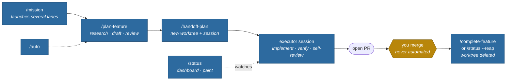

# Workflows

How the [supacode](README.md) skills compose. The pipeline is **plan → hand
off → implement → PR → merge (always you, by hand) → clean up**. Each lane of
work gets its own Supacode worktree and Claude session, so your main session
stays free.



## Hands-on: one feature, reviewed at each step

You want to stay in the loop on the plan before anything runs.

```
/supacode:plan-feature fix the vent double-tap bug
# … research happens, you approve the plan in plan mode …
/supacode:handoff-plan --launch vent-double-tap
```

The plan is saved to `~/.claude/plans/<repo>/`, a worktree is created on a
new branch, and a fresh Claude session starts there — it implements, verifies,
opens a PR, and stops. **Nothing ever merges a PR; that's always you.** After
you merge on GitHub, go to that session and run `/supacode:complete-feature`
to verify the merge, save learnings, and delete the worktree.

## Fire-and-forget: one lane, no approval gate

You trust the pipeline for a well-scoped task and just want it done.

```
/supacode:auto A4        # shorthand for: /supacode:plan-feature A4 --auto
```

Planning, adversarial review, worktree creation, and executor launch all
happen without stopping — *unless* the review finds a reason not to (work
needs splitting, a trade-off needs your call, the milestone is already in
flight), in which case it stops and presents instead of launching.

**Already wrote the plan yourself?** Link it from the milestone entry
(`[plan](docs/plans/thing.md)`) and planning is skipped: your file is adopted
as-is — steps carried through verbatim, missing sections like Verification
filled in — reviewed for feasibility and blast radius, then handed off. If the
review would change your approach, it reports back instead of rewriting you.

## Parallel wave: several lanes at once

You have a roadmap with independent milestones and want them worked
concurrently.

```
/supacode:mission 3          # proposes 3 lanes, you approve which ones launch
/loop 15m /supacode:status --reap   # optional: hands-off monitoring + cleanup
```

Mission discovers candidates, then plans **all approved lanes concurrently**
(one subagent each), reviews the finished plans against each other for real
file/subsystem collisions, and launches the survivors. Lanes that don't make
it — an unresolved trade-off, work that needs splitting, or a collision with
a sibling — come back **deferred**, and mission offers to open an interactive
planning session in a new tab for each, where you answer the open questions
yourself.

From there, `status` is your dashboard: every lane's branch, PR state, session
liveness, and a verdict telling you the next action. As you merge PRs on
GitHub, `--reap` deletes lanes that are provably finished (merged, clean,
session closed) — every check re-verified right before deletion, anything
ambiguous reported instead of touched, which is what makes looping it safe.

## Checking in

```
/supacode:status
```

Run it any time — after lunch, after merging a few PRs, after a crash — to
see where every lane stands. It derives everything from `git`/`gh`/`supacode`
live, so it's accurate even if sessions died or you merged things manually.

Add `--paint` and the verdicts also land in Supacode's sidebar — each lane
tinted by state (blue working, purple PR-open, green merged, orange stalled,
red needs attention) with a compact marker in its title (`✓#42`, `⚠`). Loop
it with `--reap --paint` and the sidebar stays current while finished lanes
clean themselves up.

## Driving the app directly

`supacode-cli` isn't a workflow step — it's the reference the other skills
lean on. It also triggers on its own for one-off requests like "spin up a
worktree for X and start a session there" or "stop the dev server in that
lane", so you can drive Supacode conversationally without invoking a full
planning pipeline.
